# Module dependency map

## Quy tắc phụ thuộc

1. `modules/*` **cấm** import `next/*`, `react`, hoặc `apps/*`.
2. Module A gọi module B chỉ qua public API (`modules/b/index.ts`).
3. Ưu tiên domain event thay vì gọi chéo trực tiếp khi quan hệ là "thông báo"
   chứ không phải "cần kết quả ngay".
4. `packages/*` không được import `modules/*`. Chiều phụ thuộc luôn là
   `apps → modules → packages`.

## Sơ đồ

```mermaid
graph LR
  subgraph apps
    WEB[apps/web]
    WORKER[apps/worker]
    MINI[apps/miniapp]
  end

  subgraph modules
    RETAIL[retail]
    INVENTORY[inventory]
    PRODUCTS[products]
    CRM[crm]
    WORKFORCE[workforce]
    COMP[compensation]
    B2B[b2b]
    MKT[marketing]
    FIN[finance]
    INTEL[intelligence]
  end

  subgraph packages
    DB[(database)]
    PERM[permissions]
    AUTH[auth]
    CFG[config]
    EVT[events]
    INTEG[integrations]
  end

  WEB --> RETAIL & INVENTORY & PRODUCTS & CRM & WORKFORCE & COMP & B2B & MKT & FIN
  WORKER --> RETAIL & COMP & INTEL & CRM
  MINI --> PRODUCTS & CRM & RETAIL

  RETAIL --> INVENTORY
  RETAIL --> PRODUCTS
  RETAIL --> CRM
  INVENTORY --> PRODUCTS
  COMP --> WORKFORCE
  COMP -.qua event.-> RETAIL
  B2B --> CRM
  B2B -.qua event.-> COMP
  MKT --> CRM
  FIN -.qua event.-> RETAIL
  INTEL -.chỉ đọc.-> DB

  RETAIL & INVENTORY & PRODUCTS & CRM & WORKFORCE & COMP & B2B & MKT & FIN --> DB
  RETAIL & INVENTORY & CRM & WORKFORCE & COMP & B2B --> PERM
  RETAIL & COMP --> CFG
  RETAIL & INVENTORY & B2B --> EVT
  RETAIL --> INTEG
```

Đường nét đứt = giao tiếp qua domain event, không gọi trực tiếp.

## Vì sao compensation không gọi thẳng retail

Hoa hồng phụ thuộc đơn hàng, nhưng nếu `compensation` import `retail` thì hai
module dính chặt và không tách được. Thay vào đó `retail` phát `ORDER_PAID`,
`compensation` lắng nghe và tự ghi `commission_record`.

Đổi lại: hoa hồng có độ trễ bằng chu kỳ worker. Chấp nhận được — hoa hồng chốt
theo kỳ, không cần realtime.

## Module đã có mã nguồn

Tính đến 2026-08-15: **chưa module nào**. Phase 0 mới xây `packages/*`.
Module đầu tiên sẽ là `retail` ở Phase 1.
