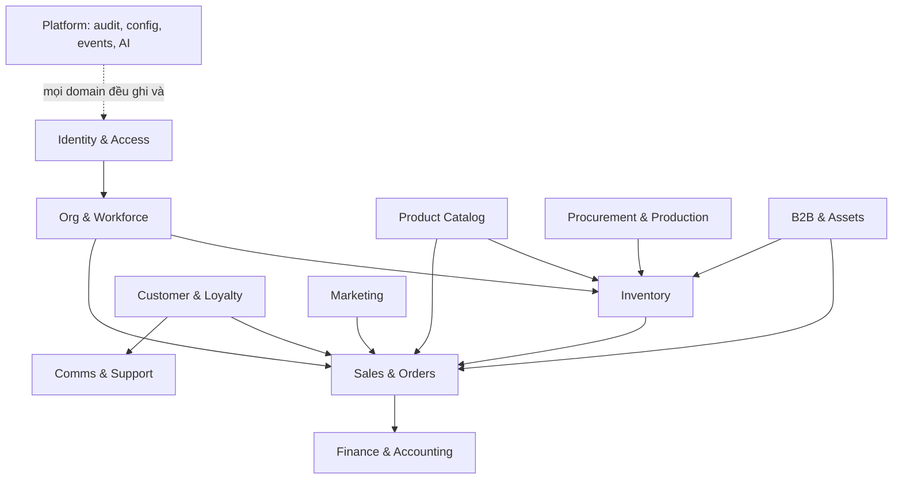

# Database domain map — AESCENTIC OS

90+ thực thể, chia thành 12 domain. Mỗi domain sở hữu bảng của mình; domain khác
chỉ tham chiếu qua khoá ngoại, không ghi chéo.

## Sơ đồ phụ thuộc giữa domain

Mũi tên = "phụ thuộc vào". Không có vòng lặp: `Platform` bị mọi domain dùng nhưng
không phụ thuộc ngược lại domain nào.

## Thực thể theo domain

**Identity & Access** — `user · role · permission · role_permission · user_role ·
user_store_assignment · session_log`

**Org & Workforce** — `store · region · department · employee · employment ·
shift_template · shift · shift_assignment · attendance · leave_request ·
leave_balance · employee_document`

**Product Catalog** — `category · collection · product · sku · product_media ·
fragrance_profile · product_training · product_lifecycle_event · price_list ·
price_list_item · product_cost` *(giá vốn tách bảng — RLS)*

**Inventory** — `inventory_location · inventory_balance · inventory_transaction ·
stock_request · stock_transfer · stock_transfer_line · stock_count ·
stock_count_line · stock_discrepancy`

**Sales & Orders** — `order · order_line · order_line_cost` *(RLS)* · `payment ·
return_order · return_line · sales_daily_report · sales_qualitative_note`

**Customer & Loyalty** — `customer · customer_address · customer_identity`
*(gộp Zalo/Nhanh/POS)* · `customer_segment · customer_segment_member ·
customer_preference · scent_id · scent_quiz_result · loyalty_account ·
loyalty_transaction · wishlist · scent_wardrobe_item`

**Marketing** — `campaign · campaign_store · campaign_product ·
campaign_acknowledgement · promotion · voucher · voucher_redemption · gift ·
gift_allocation`

**Procurement & Production** — `supplier · supplier_performance ·
purchase_request · purchase_order · purchase_order_line · goods_receipt ·
raw_material · bom · bom_line · formula · production_order · batch ·
qc_inspection · qc_defect`

**Finance & Accounting** — `invoice · invoice_line · einvoice_request ·
expense · expense_line · budget · budget_line · cash_movement ·
store_pnl_snapshot · accounting_export`

**Compensation** — `kpi_definition · kpi_target · kpi_result ·
commission_rule · commission_record · payroll_run · payroll_line ·
payroll_adjustment`

**B2B & Assets** — `b2b_account · b2b_contact · lead · opportunity ·
site_survey · quotation · quotation_version · contract · contract_line ·
machine_asset · installation · maintenance · refill_schedule · receivable ·
bni_chapter · bni_member · referral · one_to_one_meeting`

**Comms & Support** — `conversation · message · message_attachment ·
announcement · acknowledgement · ticket · ticket_event · sla_policy ·
task · task_recurrence · sop_document · document_version`

**Platform** — `audit_log · domain_event · outbox · config_setting ·
integration_account · integration_sync_state · notification ·
notification_preference · ai_interaction · ai_document_chunk` *(pgvector)* ·
`alert · alert_rule`

## Quy ước xuyên suốt

| Quy ước | Áp dụng cho |
| --- | --- |
| `id uuid primary key default gen_random_uuid()` | mọi bảng |
| `created_at`, `updated_at` | mọi bảng |
| `created_by`, `updated_by` → `user.id` | bảng có người thao tác |
| `source text` + `external_ref text` + unique `(source, external_ref)` | mọi bảng đồng bộ từ ngoài |
| `effective_from`, `effective_to` | mọi bảng cấu hình/quy tắc |
| Tiền: `bigint` (đơn vị đồng, không thập phân) | mọi cột tiền |
| Số lượng: `numeric(14,3)` | nguyên vật liệu, ml tinh dầu |
| Số lượng: `integer` | hàng bán theo chai |
| Xoá mềm `archived_at` thay vì DELETE | bảng có tham chiếu tài chính |

**Không bao giờ dùng `float` cho tiền.**

## Bảng có RLS làm lớp phòng thủ thứ hai

`product_cost · order_line_cost · payroll_run · payroll_line ·
payroll_adjustment · employee_document · commission_record`

## Chi tiết Phase 0

Xem `docs/database/erd-phase-0.md` — sơ đồ đầy đủ các bảng đã triển khai thật.
Các domain còn lại sẽ có ERD chi tiết riêng khi tới phase của nó; viết trước bây
giờ chỉ tạo ra tài liệu sai trước khi kịp dùng.
